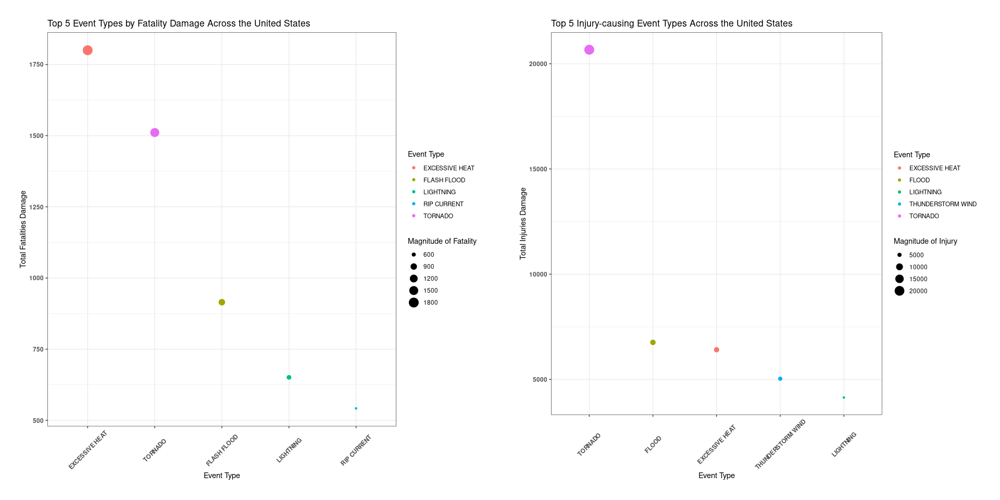
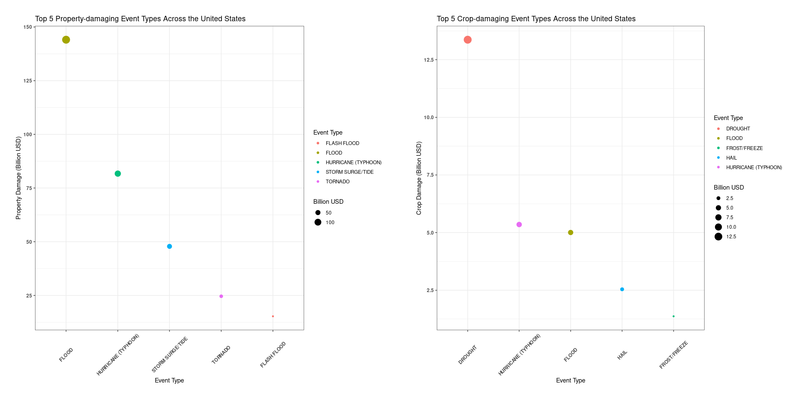

## Introduction

The aim of this analysis is to identify what event types (natural disasters) that cause more damage to population health and to the economy across the US between the years 1950 and 2011. Severe events can result in catastrophic damage to the public in terms of health impact (fatalities, injuries), and economic impact (property damage and crop destruction). The data is available [here](https://d396qusza40orc.cloudfront.net/repdata%2Fdata%2FStormData.csv.bz2). There is a documentation available [here](https://d396qusza40orc.cloudfront.net/repdata%2Fpeer2_doc%2Fpd01016005curr.pdf) to explain the dataset indepth. This [FAQ](https://d396qusza40orc.cloudfront.net/repdata%2Fpeer2_doc%2FNCDC%20Storm%20Events-FAQ%20Page.pdf) is also available. 


## Processing the data

These libraries are needed. 

```r
library(dplyr)
library(data.table)
library(stringr)
library(lubridate)
library(ggplot2)
library(gridExtra)
```

Download the file. The file Url is available. If the file is not available in the directory, the download process will be start. 

```r
file <- 'StormData.csv.bz2'
fileUrl <- "https://d396qusza40orc.cloudfront.net/repdata%2Fdata%2FStormData.csv.bz2"
if (!file.exists(paste('./data/', file, sep=''))){
    download.file(fileUrl, destfile=paste('./data/', file, sep=''))
}
```

Read in the file. The file is read only if it is not available in the environment or cached. Also important to check the integrity of the data since that can affect this analysis. The original file dimension is 902297 rows and 37 columns. 

```r
if (!'firstStormdf' %in% ls()){
  firstStormdf <- fread(paste('./data/', file, sep=''),
                        header=T, stringsAsFactors=F, sep=',')
}
```

Just a few, negligible NA's that are not critical to this analysis. Ignore them, take note.

```r
summary(firstStormdf)
```

```
##     STATE__       BGN_DATE           BGN_TIME          TIME_ZONE        
##  Min.   : 1.0   Length:902297      Length:902297      Length:902297     
##  1st Qu.:19.0   Class :character   Class :character   Class :character  
##  Median :30.0   Mode  :character   Mode  :character   Mode  :character  
##  Mean   :31.2                                                           
##  3rd Qu.:45.0                                                           
##  Max.   :95.0                                                           
##                                                                         
##      COUNTY       COUNTYNAME           STATE              EVTYPE         
##  Min.   :  0.0   Length:902297      Length:902297      Length:902297     
##  1st Qu.: 31.0   Class :character   Class :character   Class :character  
##  Median : 75.0   Mode  :character   Mode  :character   Mode  :character  
##  Mean   :100.6                                                           
##  3rd Qu.:131.0                                                           
##  Max.   :873.0                                                           
##                                                                          
##    BGN_RANGE          BGN_AZI           BGN_LOCATI          END_DATE        
##  Min.   :   0.000   Length:902297      Length:902297      Length:902297     
##  1st Qu.:   0.000   Class :character   Class :character   Class :character  
##  Median :   0.000   Mode  :character   Mode  :character   Mode  :character  
##  Mean   :   1.484                                                           
##  3rd Qu.:   1.000                                                           
##  Max.   :3749.000                                                           
##                                                                             
##    END_TIME           COUNTY_END COUNTYENDN       END_RANGE       
##  Length:902297      Min.   :0    Mode:logical   Min.   :  0.0000  
##  Class :character   1st Qu.:0    NA's:902297    1st Qu.:  0.0000  
##  Mode  :character   Median :0                   Median :  0.0000  
##                     Mean   :0                   Mean   :  0.9862  
##                     3rd Qu.:0                   3rd Qu.:  0.0000  
##                     Max.   :0                   Max.   :925.0000  
##                                                                   
##    END_AZI           END_LOCATI            LENGTH              WIDTH         
##  Length:902297      Length:902297      Min.   :   0.0000   Min.   :   0.000  
##  Class :character   Class :character   1st Qu.:   0.0000   1st Qu.:   0.000  
##  Mode  :character   Mode  :character   Median :   0.0000   Median :   0.000  
##                                        Mean   :   0.2301   Mean   :   7.503  
##                                        3rd Qu.:   0.0000   3rd Qu.:   0.000  
##                                        Max.   :2315.0000   Max.   :4400.000  
##                                                                              
##        F               MAG            FATALITIES          INJURIES        
##  Min.   :0.0      Min.   :    0.0   Min.   :  0.0000   Min.   :   0.0000  
##  1st Qu.:0.0      1st Qu.:    0.0   1st Qu.:  0.0000   1st Qu.:   0.0000  
##  Median :1.0      Median :   50.0   Median :  0.0000   Median :   0.0000  
##  Mean   :0.9      Mean   :   46.9   Mean   :  0.0168   Mean   :   0.1557  
##  3rd Qu.:1.0      3rd Qu.:   75.0   3rd Qu.:  0.0000   3rd Qu.:   0.0000  
##  Max.   :5.0      Max.   :22000.0   Max.   :583.0000   Max.   :1700.0000  
##  NA's   :843563                                                           
##     PROPDMG         PROPDMGEXP           CROPDMG         CROPDMGEXP       
##  Min.   :   0.00   Length:902297      Min.   :  0.000   Length:902297     
##  1st Qu.:   0.00   Class :character   1st Qu.:  0.000   Class :character  
##  Median :   0.00   Mode  :character   Median :  0.000   Mode  :character  
##  Mean   :  12.06                      Mean   :  1.527                     
##  3rd Qu.:   0.50                      3rd Qu.:  0.000                     
##  Max.   :5000.00                      Max.   :990.000                     
##                                                                           
##      WFO             STATEOFFIC         ZONENAMES            LATITUDE   
##  Length:902297      Length:902297      Length:902297      Min.   :   0  
##  Class :character   Class :character   Class :character   1st Qu.:2802  
##  Mode  :character   Mode  :character   Mode  :character   Median :3540  
##                                                           Mean   :2875  
##                                                           3rd Qu.:4019  
##                                                           Max.   :9706  
##                                                           NA's   :47    
##    LONGITUDE        LATITUDE_E     LONGITUDE_       REMARKS         
##  Min.   :-14451   Min.   :   0   Min.   :-14455   Length:902297     
##  1st Qu.:  7247   1st Qu.:   0   1st Qu.:     0   Class :character  
##  Median :  8707   Median :   0   Median :     0   Mode  :character  
##  Mean   :  6940   Mean   :1452   Mean   :  3509                     
##  3rd Qu.:  9605   3rd Qu.:3549   3rd Qu.:  8735                     
##  Max.   : 17124   Max.   :9706   Max.   :106220                     
##                   NA's   :40                                        
##      REFNUM      
##  Min.   :     1  
##  1st Qu.:225575  
##  Median :451149  
##  Mean   :451149  
##  3rd Qu.:676723  
##  Max.   :902297  
## 
```

1589 county names are empty. No idea what they are. 

```r
sum(firstStormdf$COUNTYNAME=='')
```

```
## [1] 1589
```

Check the proportion of COUNTYNAME that are empty to justify removing them. 

```r
mean(firstStormdf$COUNTYNAME=='')
```

```
## [1] 0.001761061
```
The mean of those are 0.00176 or 0.176 percent of the data: REMOVE THEM. 

First, check nrows of firstStormdf.

```r
nrow(firstStormdf)
```

```
## [1] 902297
```

Removing the empty COUNTYNAME observations...

```r
fStormdf <- firstStormdf[firstStormdf$COUNTYNAME!="", ]
```

Check the nrows of firstStormdf again.

```r
nrow(fStormdf)
```

```
## [1] 900708
```

The next step is to work on the EVTYPE column. The official event types, or EVTYPE variable, should have 48 events according to the Storm data documentation. Check 'Storm Data Event Table' in the documentation. Unique(firstStormdf$EVTYPE) returns over 900 observations, instead of 48. We have to clean that up.

First, remove the leading and trailing whitespaces from EVTYPE; and change them all to upper case letters.

```r
fStormdf$EVTYPE <- toupper(trimws(fStormdf$EVTYPE))
```

Create an eventCategories vector containing all the 48 official event types and capitalize them. Capitalizing makes it easy to match and substitute. 

```r
eventCategories <- c('Astronomical Low Tide', 'Avalanche', 'Blizzard', 'Coastal Flood', 'Cold/Wind Chill',
                     'Debris Flow', 'Dense Fog', 'Dense Smoke', 'Drought', 'Dust Devil', 'Dust Storm',
                     'Excessive Heat', 'Extreme Cold/Wind Chill', 'Flash Flood', 'Flood', 'Frost/Freeze',
                     'Funnel Cloud', 'Freezing Fog', 'Hail', 'Heat', 'Heavy Rain', 'Heavy Snow', 'High Surf',
                     'High Wind', 'Hurricane (Typhoon)', 'Ice Storm', 'Lake-Effect Snow', 'Lakeshore Flood',
                     'Lightning', 'Marine Hail', 'Marine High Wind', 'Marine Strong Wind',
                     'Marine Thunderstorm Wind', 'Rip Current', 'Seiche', 'Sleet', 'Storm Surge/Tide',
                     'Strong Wind', 'Thunderstorm Wind', 'Tornado', 'Tropical Depression', 'Tropical Storm',
                     'Tsunami', 'Volcanic Ash', 'Waterspout', 'Wildfire', 'Winter Storm', 'Winter Weather')
eventCategories <-toupper(eventCategories)
```

The function below takes the EVTYPE column of fStormdf and renames the obversations to an appropriate one that matches the official event types. This uses a lot of regex and was done manually. I had to use a lot of 'common sense' (as if I am an expert) to classify some of these event types appropriately. Some uncategorized events were classified as OTHERS. 

```r
replaceWords <- function(fStormdf){

    fStormdf$EVTYPE <- str_replace_all(fStormdf$EVTYPE,
                                           pattern='.*HURRI.*|.*[TYPHOON]{7,}.*',
                                           replacement='HURRICANE (TYPHOON)')
    
    fStormdf$EVTYPE <- str_replace_all(fStormdf$EVTYPE,
                                           pattern='^[MUD|LAND|ROCK]{3,}.*[SLIDE|SLUMP]{5}.*|^REMNANTS.*',
                                           replacement='DEBRIS FLOW')
    
    fStormdf$EVTYPE <- str_replace_all(fStormdf$EVTYPE,
                                           pattern='^MARINE.*TSTM.*|^MARINE.*THUNDERSTORM.*',
                                           replacement='MARINE THUNDERSTORM WIND')
    
    fStormdf$EVTYPE <- str_replace_all(fStormdf$EVTYPE,
                                            pattern='^NON[-[:space:]].*TSTM.*|^STRONG.*WIND.*',
                                            replacement='STRONG WIND')
    
    fStormdf$EVTYPE <- str_replace_all(fStormdf$EVTYPE, 
                                           pattern='.*[TORNAD]{6,}.*|.*LANDSPOUT.*|^(WALL|ROTATING).*(CLOUD).*|^(LARGE\\sWALL\\sCLOUD).*',
                                            replacement='TORNADO')
    
    fStormdf$EVTYPE <- str_replace_all(fStormdf$EVTYPE,
                                            pattern='.*[FLASH]{5,}.*|^URBAN.*|^SMALL.*|^HIGHWAY[[:space:]]FLOOD.*|^LOCAL[[:space:]]FLOOD.*|^MINOR[[:space:]]FLOOD.*|^RURAL[[:space:]]FLOOD.*|^STREET[[:space:]]FLOOD.*|^SML.*',
                                            replacement='FLASH FLOOD')
    
    fStormdf$EVTYPE <- str_replace_all(fStormdf$EVTYPE,
                                           pattern='^FLOOD.*|^MAJOR[[:space:]]FLOOD.*|^RIVER.*FLOOD.*|^STREAM[[:space:]]FLOOD.*|^(HIGH|DAM|RAPIDLY|BREAKUP).*(WATER|FAILURE|BREAK|FLOOD).*|.*DROWNING.*',
                                           replacement='FLOOD')

    fStormdf$EVTYPE <- str_replace_all(fStormdf$EVTYPE,
                                           pattern='.*[COASTAL]{7,}.*|^(BEACH|CSTL|EROSION|TIDAL).*(EROSION|FLOOD).*|.*EROSION{6,}.*|.*EROSIN.*',
                                           replacement='COASTAL FLOOD')

    fStormdf$EVTYPE <- str_replace_all(fStormdf$EVTYPE,
                                            pattern='^(?!MARINE).*HAIL.*',
                                            replacement='HAIL')
    
    fStormdf$EVTYPE <- str_replace_all(fStormdf$EVTYPE,
                                            pattern='.*[VOLCANIC]{8,}.*',
                                            replacement='VOLCANIC ASH')
   
    fStormdf$EVTYPE <- str_replace_all(fStormdf$EVTYPE,
                                            pattern='.*[BLIZZARD]{8}.*',
                                            replacement='BLIZZARD')
    
    fStormdf$EVTYPE <- str_replace_all(fStormdf$EVTYPE,
                                            pattern='^(?!EXTREME|MARINE|SEVERE|STRONG|THUNDERSTORM|COLD).*HIGH.*WIND.*|^(GUST|WIND|WHIRL|WND|WAKE|GRADIENT).*',
                                            replacement='HIGH WIND')
  
    fStormdf$EVTYPE <- str_replace_all(fStormdf$EVTYPE,
                                            pattern='^SNOW.*|^(HEAVY|DRIFTING|FALLING|MODERATE|MOUNTAIN|NEAR|SEASONAL).*(SNOWFALL|SNOW).*',
                                            replacement='HEAVY SNOW')

    fStormdf$EVTYPE <- str_replace_all(fStormdf$EVTYPE,
                                            pattern='[LIGHTNING]{9,}.*',
                                            replacement='LIGHTNING')
   
    fStormdf$EVTYPE <- str_replace_all(fStormdf$EVTYPE,
                                            pattern='^HEAVY[[:space:]].*RAIN.*|^HEAVY[[:space:]].*SHOWE.*|^HEAVY[[:space:]].*PREC.*|.*RAIN.*|^(ABNORMALLY|EXTREMELY|UNSEASONABLY|WET|EXCESSIVE|MONTHLY|MIXED|NORMAL|RECORD).*(WET|WETNESS|YEAR|WEATHER|PRECIPITATION|MONTH).*',
                                            replacement='HEAVY RAIN')

    fStormdf$EVTYPE <- str_replace_all(fStormdf$EVTYPE,
                                            pattern='^ICE.*|^ICY.*',
                                            replacement='ICE STORM')

    fStormdf$EVTYPE <- str_replace_all(fStormdf$EVTYPE,
                                            pattern='^WINTER[[:space:]][STORM]{5}.*|^GLAZE\\/ICE.*',
                                            replacement='WINTER STORM')
  
    fStormdf$EVTYPE <- str_replace_all(fStormdf$EVTYPE,
                                            pattern='^(WINTER|WINTRY|WINTERY).*(MIX|WEATHER)|.*LATE.*|.*(?=LIGHT)(?!LIGHTNING).*',
                                            replacement='WINTER WEATHER')
    
    fStormdf$EVTYPE <- str_replace_all(fStormdf$EVTYPE,
                                            pattern='.*FIRE.*',
                                            replacement='WILDFIRE')

    fStormdf$EVTYPE <- str_replace_all(fStormdf$EVTYPE,
                                           pattern='^(AGRICULTURAL|DAMAGING|EARLY|HARD|EARLY|RECORD|GLAZE|BLACK|PATCHY).*(FREEZE|FROST|ICE).*|.*FREEZE.*|.*FROST.*|^GLAZE.*',
                                           replacement='FROST/FREEZE')
    
    fStormdf$EVTYPE <- str_replace_all(fStormdf$EVTYPE,
                                           pattern='^FREEZING.*(DRIZZLE|FOG|SPRAY).*',
                                           replacement='FREEZING FOG')

    fStormdf$EVTYPE <- str_replace_all(fStormdf$EVTYPE,
                                           pattern='^FOG.*|^VOG.*|.*DENSE[[:space:]].*FOG.*',
                                           replacement='DENSE FOG')
    
    fStormdf$EVTYPE <- str_replace_all(fStormdf$EVTYPE,
                                           pattern='.*SMOKE.*',
                                           replacement='DENSE SMOKE')
    
    fStormdf$EVTYPE <- str_replace_all(fStormdf$EVTYPE, 
                                           pattern='.*(SPOUT).*',
                                           replacement='WATERSPOUT')
    
    fStormdf$EVTYPE <- str_replace_all(fStormdf$EVTYPE,
                                            pattern='.*[FUNNEL]{6,}.*',
                                            replacement='FUNNEL CLOUD')
    
    fStormdf$EVTYPE <- str_replace_all(fStormdf$EVTYPE,
                                            pattern='.*(SURF|SWELL).*',
                                            replacement='HIGH SURF')
    
    fStormdf$EVTYPE <- str_replace_all(fStormdf$EVTYPE,
                                            pattern='.*[AVALANCHE]{8,}.*',
                                            replacement='AVALANCHE')
    
    fStormdf$EVTYPE <- str_replace_all(fStormdf$EVTYPE,
                                            pattern='^(STORM|BLOW-OUT|ASTRONOMICAL)\\s(HIGH|SURGE|FORCE|WIND|TIDE).*|^(HIGH\\sTIDE)',
                                            replacement='STORM SURGE/TIDE')
    
    fStormdf$EVTYPE <- str_replace_all(fStormdf$EVTYPE,
                                            pattern='^TROPICAL[[:space:]]STORM.*',
                                            replacement='TROPICAL STORM')
   
    fStormdf$EVTYPE <- str_replace_all(fStormdf$EVTYPE,
                                            pattern='^(EXCESSIVE|EXTRME|EXTREME|EXTENDED|RECORD|UNSEASONAL|UNSEASONABLE|UNUSUALLY|PROLONG|UNSEASONABLY|SEVERE|BLOWING).*(COLD|COLDO|LOW|SNOW|WINDCHILL|WIND|COOL).*|^BITTER.*',
                                            replacement='EXTREME COLD/WIND CHILL')
    
    fStormdf$EVTYPE <- str_replace_all(fStormdf$EVTYPE,
                                            pattern='^(COOL|COLD).*|^LOW[[:space:]]TEMPER.*|.*HYPOTHERM.*',
                                            replacement='COLD/WIND CHILL')
   
    fStormdf$EVTYPE <- str_replace_all(fStormdf$EVTYPE,
                                            pattern='^DUST[[:space:]]STORM.*|^BLOWING[[:space:]]DUST.*|^DUSTSTORM.*',
                                            replacement='DUST STORM')
    
    fStormdf$EVTYPE <- str_replace_all(fStormdf$EVTYPE,
                                            pattern='^DUST[[:space:]](DEVEL|DEVIL).*|^SAHARAN[[:space:]]DUST.*',
                                            replacement='DUST DEVIL')
   
    fStormdf$EVTYPE <- str_replace_all(fStormdf$EVTYPE,
                                            pattern='.*DRY.*|^.*DROUGHT.*|^DRIEST.*',
                                            replacement='DROUGHT')
    
    fStormdf$EVTYPE <- str_replace_all(fStormdf$EVTYPE,
                                            pattern='^(EXCESSIVE|EXTREME|RECORD|HIGH|ABNORMAL|UNSEASONABLY|UNUSUAL|UNUSUALLY|VERY|WARM|PROLONG|TEMPERATURE).*(HEAT|WEATHER|TEMPERATURE|RECORD|WARMTH|WARM).*|^HEATBURST.*|.*HOT.*|.*HYPERTHERMIA.*',
                                            replacement='EXCESSIVE HEAT')
    
    fStormdf$EVTYPE <- str_replace_all(fStormdf$EVTYPE,
                                            pattern='^HEAT[[:space:]]WAVE.*|^(MONTHLY\\sTEMPERATURE)',
                                            replacement='HEAT')
    
    fStormdf$EVTYPE <- str_replace_all(fStormdf$EVTYPE,
                                            pattern='^(EARLY|LATE|MONTHLY|WET|LACK|FIRST).*SNOW.*|^LAKE.*EFFECT.*',
                                            replacement='LAKE-EFFECT SNOW')
    
    fStormdf$EVTYPE <- str_replace_all(fStormdf$EVTYPE,
                                            pattern='.*(?=SLEET).*',
                                            replacement='SLEET')
    
    fStormdf$EVTYPE <- str_replace_all(fStormdf$EVTYPE,
                                           pattern='^(TSTM|SEVERE|THUN|THUD|TUND|GUSTY).*(WIND|WND|DAMAGE|THUNDERSTORM).*|^(TSTM|THUNDERSTORM).*|.*(BURST|THUNDERSNOW).*',
                                           replacement='THUNDERSTORM WIND')
    
    fStormdf$EVTYPE <- str_replace_all(fStormdf$EVTYPE,
                                           pattern='^(HEAVY|HIGH|ROUGH).*SEAS',
                                           replacement='TSUNAMI')

    fStormdf$EVTYPE <- str_replace_all(fStormdf$EVTYPE,
                                           pattern='^(LAKE\\sFLOOD)',
                                           replacement='LAKESHORE FLOOD')
    
    fStormdf$EVTYPE <- str_replace_all(fStormdf$EVTYPE,
                                           pattern='^(RIP\\sCURRENTS).*',
                                           replacement='RIP CURRENT')
    
    fStormdf$EVTYPE <- str_replace_all(fStormdf$EVTYPE,
                                           pattern='.*(?=SUMMARY).*|[?]|^(NONE|OTHER)$',
                                           replacement='OTHERS')
    
    return(fStormdf)
}
```

Call the function above with fStormdf as its argument; re-assign it to fStormdf

```r
fStormdf <- replaceWords(fStormdf)
```

The function below changes all other events not present in eventCategories to 'OTHERS'; Uncategorized event types (and the ones that I could not categorize) are classified as OTHERS. 

```r
changeToOthers <- function(fStormdf, eventCategories){
    
    eventCategories <- toupper(eventCategories)
    
    for(i in 1:length(fStormdf$EVTYPE)){
        if (fStormdf$EVTYPE[i] %in% eventCategories){
            next
        } else {
            fStormdf$EVTYPE[i] <- 'OTHERS'
        }
    }
    
    return(fStormdf)
}
```

Call the changeToOthers function with fStormdf and eventCategories as its arguments; re-assign to fStormdf.

```r
fStormdf <- changeToOthers(fStormdf, eventCategories)
```

According to the website, each unique observation in the PROPDMGEXP and CROPDMGEXP columns has a value. We need to convert these letters and signs to their respective exponential. 

Checking the unique values of fStormdf$PROPDMGEXP:

```r
unique(fStormdf$PROPDMGEXP)
```

```
##  [1] "K" "M" ""  "B" "m" "+" "0" "5" "6" "?" "4" "2" "3" "h" "7" "H" "-" "1" "8"
```

Checking the unique values of fStormdf$CROPDMGEXP:

```r
unique(fStormdf$CROPDMGEXP)
```

```
## [1] ""  "M" "K" "m" "B" "?" "0" "k" "2"
```

This function changes the PROPDMGEXP and CROPDMGEXP columns to the appropriate exponentials. The values are found in the official documentation. 

```r
changeToExponential <- function(col){
    
    for(i in 1:length(col)){
        if(col[i] %in% c('H', 'h')){
            col[i] <- 10^2
        } else if (col[i] %in% c('K', 'k')){
            col[i] <- 10^3
        } else if (col[i] %in% c('M', 'm')){
            col[i] <- 10^6
        } else if (col[i] %in% c('B', 'b')){
            col[i] <- 10^9
        } else if (col[i] %in% paste(seq(0,8))){
            col[i] <- 10^1
        } else if (col[i] %in% c('+')){
            col[i] <- 1
        } else {
            col[i] <- 0
        }
    }
    return(col)
}
```

Call the changeToExponential function with the columns PROPDMGEXP and CROPDMGEXP as arguments. You will also need to change the type to numeric. Assign back to fStormdf. 

```r
fStormdf$PROPDMGEXP <- as.numeric(changeToExponential(fStormdf$PROPDMGEXP))
fStormdf$CROPDMGEXP <- as.numeric(changeToExponential(fStormdf$CROPDMGEXP))
```

After changing the above columns to appropriate exponential values, we need to multiply them with the values in the appropriate column. 

Multiply the PROPDMGEXP and PROPDMG COLUMNS. Do the same for CROPDMGEXP AND CROPDMG; CREATE NEW COLUMNS. 

```r
fStormdf$PropertyDamage <- fStormdf$PROPDMG * fStormdf$PROPDMGEXP
fStormdf$CropDamage <- fStormdf$CROPDMG * fStormdf$CROPDMGEXP
```

Typify the BGN_DATE column as date type. At this point, I cached the fStormdf dataframe. 

```r
fStormdf$BGN_DATE <- mdy_hms(fStormdf$BGN_DATE)
```

## Analysis and Results.

According to NOAA website, the data recording started from January 1950 with just one type of event, Tornado. However, from January 1996, all event types were recorded. So, remove these dates prior to 1996 for a fairer analysis. Assign to subStormdf. 

```r
subStormdf <- fStormdf[fStormdf$BGN_DATE > '1995-12-31 UTC', ]
```

Take out the needed columns for my analysis. I do not need them all. I need the EVTYPE, FATALITIES, INJURIES, PropertyDamage, and CropDamage.

```r
tidyStormdf <- subStormdf %>% select(EVTYPE, FATALITIES, INJURIES, PropertyDamage, CropDamage)
names(tidyStormdf)[1:3] <- c('EventType', 'Fatalities', 'Injuries')
```

I do not want to sum fatalities with injuries, or Property Damage with Crop Damage. It will make more sense to plot them on different graphs, since their orders of magnitudes are not the same. 

### Across the United States, which types of events (as indicated in the \color{red}{\verb|EVTYPE|}EVTYPE variable) are most harmful with respect to population health?

#### Population health: Fatalities and Injuries.

Group tidyStormdf by event type, summarize by the sum of TotalHealthDamage and arrange by TotalHealthDamage. 

```r
healthDamage <- tidyStormdf %>% group_by(EventType) %>% 
    summarise(TotalFatalitiesDmg=sum(Fatalities), TotalInjuriesDmg=sum(Injuries))
```

Make event type a factor and order by the size of TotalFatalitiesDmg when plotting. I will be plotting the Injuries and Fatalities separately for a fairer representation. I will also be plotting the top 5 event types with most damage in either catogory (injuries and fatalities). There was an aesthetic reason for this: plotting more than the top 15 will make the image look too small.

Plotting...

```r
fg <- ggplot(arrange(healthDamage, desc(TotalFatalitiesDmg))[1:5, ], aes(factor(EventType, levels=healthDamage$EventType[order(desc(healthDamage$TotalFatalitiesDmg))]), TotalFatalitiesDmg, col=EventType, size=TotalFatalitiesDmg)) +
  geom_point() + 
  ggtitle('Top 5 Event Types by Fatality Damage Across the United States') + 
  xlab('Event Type') + ylab('Total Fatalities Damage') + theme_bw() +
  theme(axis.text.x=element_text(angle=45, vjust=0.5, face='bold'), axis.text.y=element_text(face='bold'), plot.margin=unit(c(1,1,1,1), 'cm')) + 
  labs(size='Magnitude of Fatality', col='Event Type')  + 
  scale_y_continuous(breaks=seq(0, 2000, by=250))

ig <- ggplot(arrange(healthDamage, desc(TotalInjuriesDmg))[1:5, ], aes(factor(EventType, levels=healthDamage$EventType[order(desc(healthDamage$TotalInjuriesDmg))]), TotalInjuriesDmg, col=EventType, size=TotalInjuriesDmg)) +
  geom_point() + 
  ggtitle('Top 5 Injury-causing Event Types Across the United States') +
  xlab('Event Type') + 
  ylab('Total Injuries Damage') + 
  theme_bw () + 
  theme(axis.text.x=element_text(angle=45, vjust=0.5, face='bold'), axis.text.y=element_text(face='bold'), plot.margin=unit(c(1,1,1,1), 'cm')) + 
  labs(size='Magnitude of Injury', col='Event Type')  + 
  scale_y_continuous(breaks=seq(0, 25000, by=5000))

grid.arrange(fg, ig, nrow=1)
```

<!-- -->
We see that Excessive Heat, Tornado, and Flash Flood cause the most fatal damages to the public, while Tornado, Flood and Excessive Heat cause the most injuries to the public. 

### Across the United States, which types of events have the greatest economic consequences?

#### Economic Damage: Property and Crops

Group tidyStormdf by event type, summarize by the sum of total damages (which is the sum of property damage and crop damage), arrange by descending economic damage and create a new column of EconomicDamage but in billions.

```r
economicDamage <- tidyStormdf %>% group_by(EventType) %>% summarize(TotalPropertyDamage=sum(PropertyDamage), TotalCropDamage=sum(CropDamage))
```

Make event type a factor and order by the size of the damage when plotting. I will be plotting the property damage and crop damage separately for a fairer representation. I will also be plotting the top 5 event types with most damage in either catogory (Properties and Crops). There was an aesthetic reason for this: plotting more than the top 15 will make the image look too small.

Plotting...

```r
pg <- ggplot(arrange(economicDamage, desc(TotalPropertyDamage))[1:5, ], aes(factor(EventType, levels=economicDamage$EventType[order(desc(economicDamage$TotalPropertyDamage))]), TotalPropertyDamage/10^9, col=EventType, size=TotalPropertyDamage/10^9)) + 
  geom_point() + 
  ggtitle('Top 5 Property-damaging Event Types Across the United States') + 
  xlab('Event Type') + 
  ylab('Property Damage (Billion USD)') + 
  theme_bw () + 
  theme(axis.text.x=element_text(angle=45, vjust=0.5, face='bold'), axis.text.y=element_text(face='bold'), plot.margin=unit(c(1,1,1,1), 'cm')) + 
  labs(size='Billion USD', col='Event Type') + 
  scale_y_continuous(breaks=seq(0, 150, by=25))

cg <- ggplot(arrange(economicDamage, desc(TotalCropDamage))[1:5, ], aes(factor(EventType, levels=economicDamage$EventType[order(desc(economicDamage$TotalCropDamage))]), TotalCropDamage/10^9, col=EventType, size=TotalCropDamage/10^9)) + 
  geom_point() + 
  ggtitle('Top 5 Crop-damaging Event Types Across the United States') + 
  xlab('Event Type') + ylab('Crop Damage (Billion USD)') + 
  theme_bw () + 
  theme(axis.text.x=element_text(angle=45, vjust=0.5, face='bold'), axis.text.y=element_text(face='bold'), plot.margin=unit(c(1,1,1,1), 'cm'))  + 
  labs(size='Billion USD', col='Event Type') + 
  scale_y_continuous(breaks=seq(0, 15, by=2.5))

grid.arrange(pg, cg, nrow=1)
```

<!-- -->

We see that Flood, Hurricane (Typhoon), and Storm Surge/Tide caused the most damage to properties, while Drought, Hurricane (Typhoon), and Flood cause the most damage to crops. (This sorts of makes sense for Drought).

## Conclusion

At the end of the analysis, we find out that Excessive Heat, Flood, Flash Flood, and Tornado cause the most public health damage, while Flood, Hurricane (Typhoon), and Drought and Storm Surge/Tide have the most economic impact. Interestingly, and probably as expected, Drought caused the most damage to crops. 
